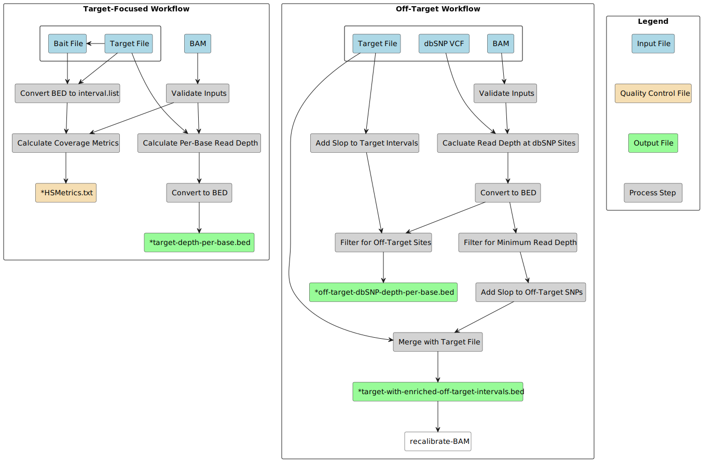

# Calculate Targeted Coverage

- [Calculate Targeted Coverage](#calculate-targeted-coverage)
  - [Overview](#overview)
  - [How To Run](#how-to-run)
  - [Flow Diagram](#flow-diagram)
  - [Pipeline Steps](#pipeline-steps)
    - [1. Depth Calculation](#1-depth-calculation)
    - [2. BED Formatting](#2-bed-formatting)
    - [3. dbSNP off-target site filtering](#3-dbsnp-off-target-site-filtering)
    - [4. dbSNP enriched read depth filtering](#4-dbsnp-enriched-read-depth-filtering)
    - [5. dbSNP coverage-enriched interval expansion](#5-dbsnp-coverage-enriched-interval-expansion)
    - [6. On-target and enriched off-target interval merging](#6-on-target-and-enriched-off-target-interval-merging)
    - [7. Metrics Reporting](#7-metrics-reporting)
  - [Inputs and Configuration](#inputs-and-configuration)
  - [Outputs](#outputs)
  - [Testing and Validation](#testing-and-validation)
    - [Test Data Set](#test-data-set)
    - [Validation \<version number\>](#validation-version-number)
    - [Validation Tool](#validation-tool)
  - [References](#references)
  - [Discussions](#discussions)
  - [Contributors](#contributors)
  - [License](#license)
## Overview
This pipeline extracts read depth calculations from a BAM file and generates outputs that are useful to the interpretation and downstream variant calling of a targeted sequencing experiment. Relevant datasets include targeted gene panels and whole exome sequencing (WXS) experiments. For in-depth downstream coverage QC, the pipeline can output per-base read depth at all targeted loci specified by a target BED file and read depth at genome-wide "off-target" well characterized polymorphic sites known to dbSNP. For a more general overview of targeted sequencing quality, the pipeline can output QC metrics produced by `picard CollectHsMetrics`. As a direct contribution to a DNA processing workflow, the pipeline can output a coordinate BED file containing target intervals merged with intervals encompassing off-target dbSNP sites enriched in coverage (as determined by a user-defined read-depth threshold). This new coordinate file can be used to indicate base quality recalibration and variant calling intervals to [`pipeline-recalibrate-BAM`](https://github.com/uclahs-cds/pipeline-recalibrate-BAM/blob/34e0e8ccc46eb406087baec1bb858fa9c2f4c4ad/config/template.config#L37) and `gatk HaplotypeCaller`in [`pipeline-call-gSNP`](https://github.com/uclahs-cds/pipeline-call-gSNP/blob/43bf6bd2ccf2abce61701ac1d52105d408e934a4/config/template.config#L28) directly or through `metapipeline-DNA`.

calculates per-base read depth in a BAM file at "target" intervals specified by a target BED file and at "off-target" well characterized polymorphic loci 
This pipeline performs coverage calculations from a BAM file at intervals specified by a target bed file and reports some basic coverage metrics. The SAMtools depth tool is used to calculate per-base coverage in specified regions. This intermediate output is converted into bed format using an awk script. Then the BEDtools merge tool is used to collapse consecutive coordinates into intervals, with a final output reporting a comma-separated list of per-base read depths for each coordinate in an interval. Picard's CollectHsMetrics is used to report various interval related metrics on the input BAM.

---

## How To Run

1. Update the params section of the .config file

2. Update the input yaml

3. See the submission script, [here](https://github.com/uclahs-cds/tool-submit-nf), to submit your pipeline

---

## Flow Diagram

A directed acyclic graph of your pipeline.

---

## Pipeline Steps

### 1. Depth Calculation

> Per-base depth is calculated from the input BAM file at coordinates specified by the input target BED file using `samtools depth`. If `off_target_depth` is set to `true`, per-base read depth is also calculated genome-wide at dbSNP loci with a dbSNP reference VCF used as the coordinate file to `samtools depth`.

### 2. BED Formatting

> TSV output from `samtools depth` is converted into BED format using `awk` with read depth reported in the fourth column. Per-base read depth across multiple-base-pair target intervals is collapsed into a comma-separated list of read depth values, one for each base pair encompassed by the interval (`bedtools merge`).

### 3. dbSNP off-target site filtering

> dbSNP coordinates are filtered to keep only off-target regions. This is done by excluding coordinates specified in the target BED file from the dbSNP read depth BED using `bedtools intersect`. Near-target regions (+/- 500bp by default) are also excluded by first adding near-target buffers to the specified target intervals using `bedtools slop`.

### 4. dbSNP enriched read depth filtering

> dbSNP coordinates from step 2 are filtered to keep sites exceeding a minimum read depth threshold (30x by default) using `awk`.

### 5. dbSNP coverage-enriched interval expansion

> Filtered dbSNP coordinates from step 4 are expanded to include nearby basepairs, so that sites that are close together can be subsequently be merged into one interval (`bedtools slop`).

### 6. On-target and enriched off-target interval merging

> Coverage enriched dbSNP intervals are merged with the original target intervals into one BED file using a series of bash commands that concatenate and sort the two files, then merge with `bedtools`.

### 7. Metrics Reporting

> Target BED file and optional bait file are converted to INTERVAL_LIST format using picard `BedToIntervalList` then used to report metrics on input BAM with picard `CollectHsMetrics`.

---

## Inputs and Configuration

 Input and Input Parameter/Flag | Required | Type | Description |
| ------------ | ------------ | ------- | ------------------------ |
| `input.BAM` | yes | path | BAM file for which to calculate coverage, path provided in input yaml. |
| `target_BED` | yes | path | BED file specifying target intervals (defines regions for target and off-target coverage operations). |
| `save_intermediate_files` | yes | boolean | Whether to save intermediate files. |
| `reference_dict` | yes | path | Human genome reference dictionary file for use in BED to INTERVAL_LIST conversion. Required if collecting metrics.|
| `reference_dbSNP` | yes | path | dbSNP reference VCF file, with proper chromosome encoding and compression. See [discussion](https://github.com/uclahs-cds/pipeline-targeted-coverage/discussions/18#:~:text=Troubleshooting%20dbSNP%20reference%20file). Required if performing off-target read depth calculation. |
| `genome_sizes` | yes | path | Reference file consisting of chromosomes and their lengths used by `bedtools slop`. Required for off-target read depth workflows. `.fai` files accepted. |
| `target_depth` | no | bool | Whether to calculate per-base read depth in targeted regions. Default false.|
| `off_target_depth` | no | bool | Whether to perform off-target read depth calculation at dbSNP loci. Default true.|
| `output_enriched_target_file` | no | bool | Whether to output a new target file containing coverage-enriched off-target dbSNP loci. Default true.|
| `min_read_depth` | no | bool | Minimum read depth threshold for an off-target locus to be considered enriched and be included in the new target file. Default 30.|
| `min_base_quality` | no | integer | Minimum base quality for a read to be counted in depth calculation by `samtools depth`. Applies to both off- and on-target calculations. Defaults to 20. |
| `min_mapping_quality` | no | integer | Minimum mapping quality for a read to be counted in depth calculation by `samtools depth`. Applies to both off- and on-target calculations. Defaults to 20. |
| `collect_metrics` | no | bool | Whether to run `CollectHsMetrics`. Default true.|
| `target_interval_list` | no | path | Interval list file specifying target intervals used to calculate coverage by `collecHsMetrics`. If not provided, the target BED will be used to calculate the intervals. |
| `bait_BED` | no | path | BED file with bait locations that can be used to generate a bait interval list used by `CollecHsMetrics`. If not provided, the target BED will be used. |
| `bait_interval_list` | no | path | Interval list file specifying bait intervals used by `CollectHsMetrics`. If not provided, the bait BED will be used to calculate the intervals.|
| `save_interval_list` | yes | boolean | Whether to save a copy of any generated interval lists. Saves to the `output_dir`. |
| `save_all_dbSNP` | no | boolean | Whether to save a copy of the read depth BED file for all dbSNP loci generated by the off-target workflows. Default false.|
| `save_raw_target_bed` | no | boolean | Whether to save a copy of the per-base, target read depth BED with uncollapsed intervals. Default false.|
| `off_target_slop` | no | integer | Number of base pairs to add to either side of target file coordinates so that they may be excluded from off-target read depth calculation. Default is 500.|
| `dbSNP_slop` | no | integer | Number of base pairs to add to either side of off-target dbSNP loci to generate off-target intervals. The purpose is to merge adjacent dbSNP loci into single intervals prior to mergeing with target intervals. Default is 150.|
| `coverage_cap` | no | integer | `COVERAGE_CAP` parameter for `CollectHsMetrics`, determines the coverage threshold at which to stop calculating coverage. |
| `near_distance` | no | integer | `NEAR_DISTANCE` parameter for `CollectHsMetrics`, determines the maximum distance in bp of a read from the nearest probe (bait) for it to be counted as "near probe" in metrics calculations. Default 250. |
| `samtools_depth_extra_args` | no | string | Extra arguments for `samtools depth`. |
| `picard_CollectHsMetrics_extra_args` | no | string | Extra arguments for `picard CollectHsMetrics`. |
| `merge_operation` | no | string | Operation performed on read depth column values when intervals are collapsed during `bedtools merge`. Defaults to 'collapse'. See [bedtools documentation](https://bedtools.readthedocs.io/en/latest/content/tools/merge.html#:~:text=%2Dc.-,Valid%20operations%3A,-sum%2C%20min%2C%20max) for other options. |
| `work_dir` | no | path | Path of working directory for Nextflow. When included in the sample config file, Nextflow intermediate files and logs will be saved to this directory. With ucla_cds, the default is `/scratch` and should only be changed for testing/development. Changing this directory to `/hot` or `/tmp` can lead to high server latency and potential disk space limitations, respectively. |

---

## Outputs

 Output and Output Parameter/Flag | Description |
| ------------ | ------------------------ |
| `output_dir` | Location where generated output should be saved. |
| `*target-with-enriched-off-target-intervals.bed` | New target file including original target intervals and intervals encompassing coverage-enriched off-target dbSNP sites. |
|`*off-target-dbSNP-depth-per-base.bed`|Per-base read depth at dbSNP loci outside of targeted regions.|
| `*collapsed_coverage.bed` | Per-base read depth at specified target intervals, collapsed by interval. (OPTIONAL) Set `target_depth` in config file. |
|`*target-depth-per-base.bed`|Per-base read depth at target intervals (not collapsed). (OPTIONAL) set `save_raw_target_bed` in config file.|
|`*genome-wide-dbSNP-depth-per-base.bed`| Per-base read depth at all dbSNP loci. (OPTIONAL) Set `save_all_dbSNP` in config file.|
| `*HsMetrics.txt` | QC output from CollectHsMetrics()|
| `.tsv`,`.bed` | Intermediate outputs of unformatted and unmerged depth files. (OPTIONAL) Set `save_intermediate_files` in config file. |
| `.interval_list` | Intermediate output of target bed file converted to picard's interval list format. (OPTIONAL)  Set `save_interval_list` in config file. |
| `report.html`, `timeline.html` and `trace.txt` | A Nextflowreport, timeline and trace files |
| `log.command.*` | Process specific logging files created by nextflow. |

---

## Testing and Validation

### Test Data Set

Testing was performed leveraging aligned and sorted BAMs from a targeted panel sequencing experiment generated using bwa-mem2-2.1 against reference GRCh38.
- **BZPRGPT2:** BZPRGPT1000001-N001-B01-F.bam

Test runs were performed with the following reference files
- **reference_dict:** '/hot/ref/reference/GRCh38-BI-20160721/Homo_sapiens_assembly38.dict'
- **reference_dbSNP:** '/hot/ref/database/dbSNP-155/thinned/GRCh38/dbSNP-155_thinned_hg38.vcf.gz'
- **genome_sizes:** '/hot/ref/reference/GRCh38-BI-20160721/Homo_sapiens_assembly38.fasta.fai'

### Validation <version number\>

See [here](https://github.com/uclahs-cds/pipeline-targeted-coverage/discussions/30) for benchmarking.

 Input/Output | Description | Result
 | ------------ | ------------------------ | ------------------------ |
| metric 1 | 1 - 2 sentence description of the metric | quantifiable result |
| metric 2 | 1 - 2 sentence description of the metric | quantifiable result |
| metric n | 1 - 2 sentence description of the metric | quantifiable result |

- [Reference/External Link/Path 1 to any files/plots or other validation results](<link>)
- [Reference/External Link/Path 2 to any files/plots or other validation results](<link>)
- [Reference/External Link/Path n to any files/plots or other validation results](<link>)

### Validation Tool

Included is a template for validating your input files. For more information on the tool check out: https://github.com/uclahs-cds/tool-validate-nf

---

## References

1. [Reference 1](<links-to-papers/external-code/documentation/metadata/other-repos/or-anything-else>)
2. [Reference 2](<links-to-papers/external-code/documentation/metadata/other-repos/or-anything-else>)
3. [Reference n](<links-to-papers/external-code/documentation/metadata/other-repos/or-anything-else>)

---

## Discussions

- [Issue tracker](https://github.com/uclahs-cds/pipeline-targeted-coverage/issues) to report errors and enhancement ideas.
- Discussions can take place in [pipeline-calculate-targeted-coverage Discussions](https://github.com/uclahs-cds/pipeline-targeted-coverage/discussions)
- [pipeline-calculate-targeted-coverage pull requests](https://github.com/uclahs-cds/pipeline-targeted-coverage/pulls) are also open for discussion.

---

## Contributors

Please see list of [Contributors](https://github.com/uclahs-cds/pipeline-targeted-coverage/graphs/contributors) at GitHub.

---

## License

pipeline-calculate-targeted-coverage is licensed under the GNU General Public License version 2. See the file LICENSE for the terms of the GNU GPL license.

<one line to give the program's name and a brief idea of what it does.>
pipeline-calculate-targeted-coverage performs read-depth related calculations on BAMs from targeted sequencing experiments.

Copyright (C) 2022 University of California Los Angeles ("Boutros Lab") All rights reserved.

This program is free software; you can redistribute it and/or modify it under the terms of the GNU General Public License as published by the Free Software Foundation; either version 2 of the License, or (at your option) any later version.

This program is distributed in the hope that it will be useful, but WITHOUT ANY WARRANTY; without even the implied warranty of MERCHANTABILITY or FITNESS FOR A PARTICULAR PURPOSE. See the GNU General Public License for more details.
